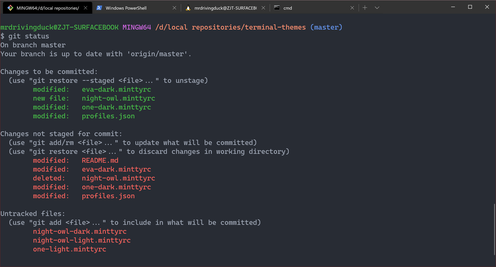

# terminal-themes

🖌️ Configuration files of terminal themes.

Created by : Mr Dk.

2019 / 09 / 06 16:25

Nanjing, Jiangsu, China

---

## Windows Terminal integrated with Git-Bash

Overwrite the configuration file of [*Windows Terminal*](https://github.com/microsoft/terminal) - `profiles.json` :

* Add a new item into `"profiles"` array
* Set the `"commandline"` property as the path of Git-Bash - `<git_path>/bin/bash.exe`
* Set the `"icon"` property as the logo path of [_Git for Windows_](https://gitforwindows.org/) - `gwindows_logo.png`
* Name this item by `"name"` property, e.g., `Git Bash`
* Set the color scheme of this item by setting `"colorScheme"` property
* Set this item as start-up terminal by setting `"global.defaultProfile"` property to the `"guid"` of this item

🎃 The effect looks like this: (*Eva Dark* theme)

## Windows Terminal Themes

See [themes](https://atomcorp.github.io/themes/).

---

## License

Copyright © 2019-2020, Jingtang Zhang. ([GNU General Public License v3.0](LICENSE))

---

